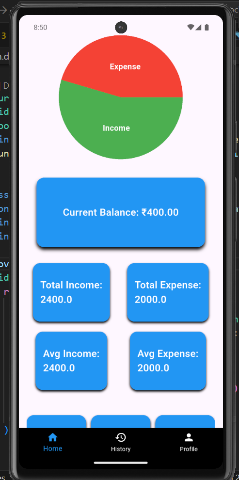
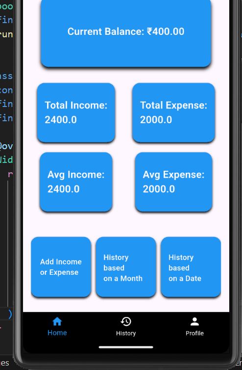
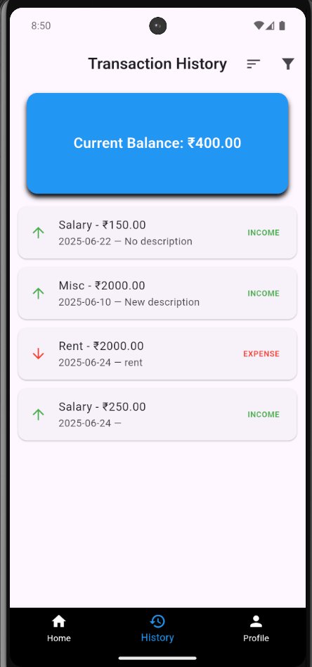
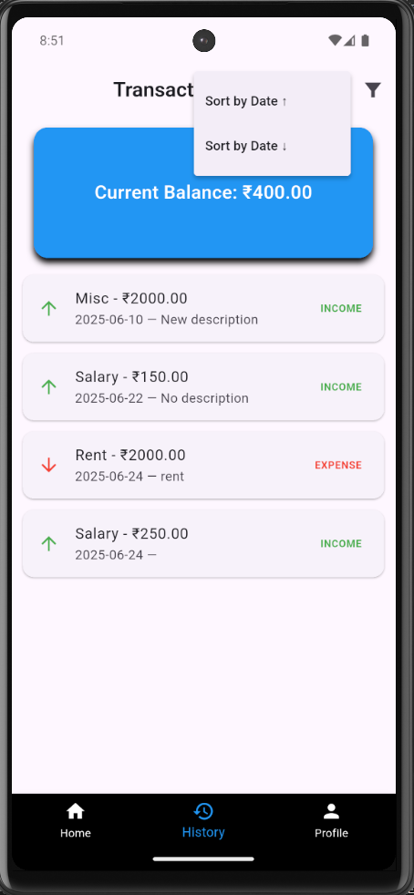
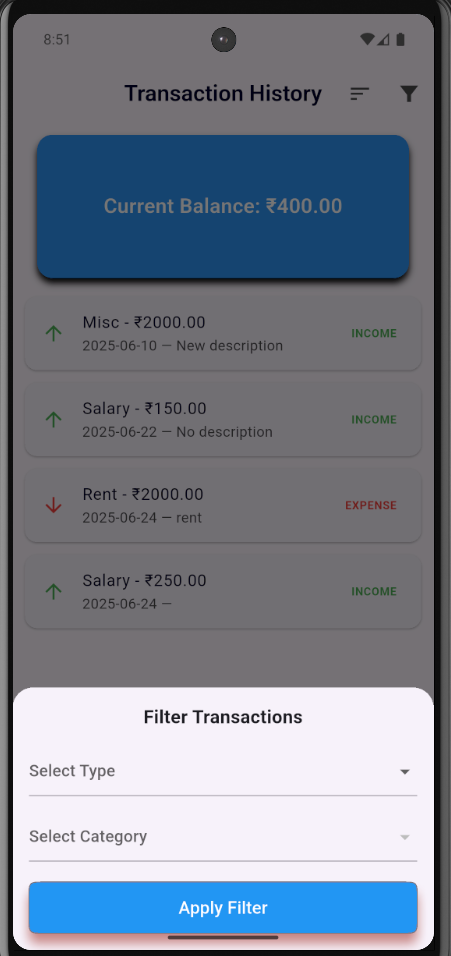
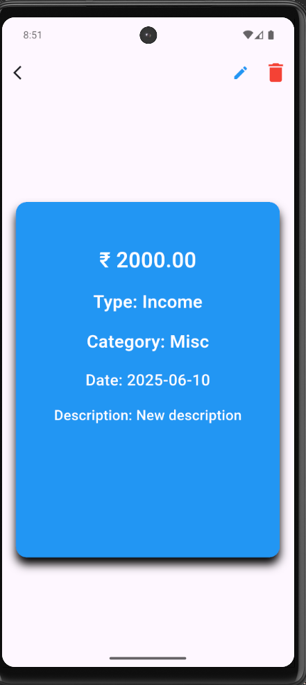
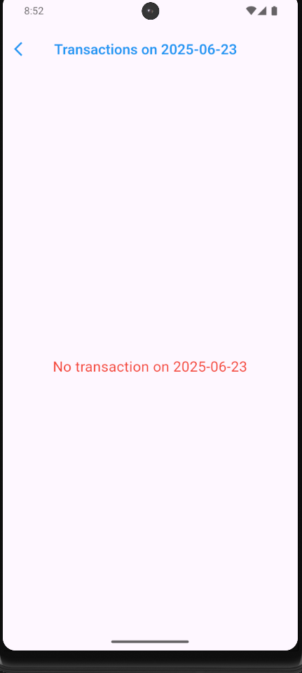
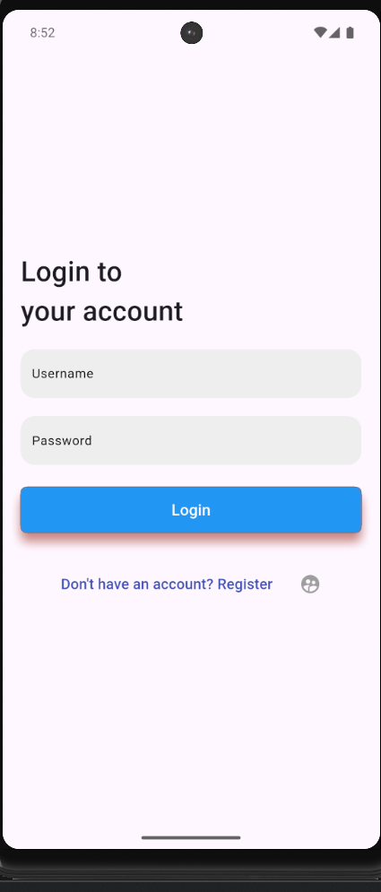

# Dime Drop 

A personal finance management app.

    Dime Drop is a personal finance management app that helps you keep track of your incomes and expenses throughout the year.The apps shows you your income and expense as a graph and also displays the incomes and expenses of a specific date as well as a specific month.You can view all your transactions and edit or delete them.You are required to be authenticated to use the app.       